

Google Earth plugin API samples ported to Cesium, the open-source WebGL virtual globe and map engine.

Click on any example below to run it.  To learn more about Cesium, check out the <a href="http://cesiumjs.org/for-google-earth-developers.html" target="_blank">Cesium for Google Earth Developers</a> tutorial series.

<table>
    <tr>
        <td>
          <a href="http://analyticalgraphicsinc.github.io/cesium-google-earth-examples/demos/helloearth/" target="_blank">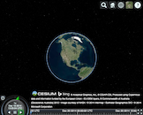</a>
        </td>
        <td>
          <a href="http://analyticalgraphicsinc.github.io/cesium-google-earth-examples/demos/helloearth/" target="_blank">Hello, Earth</a>
          
(Google Earth <a href="http://earth-api-samples.googlecode.com/svn/trunk/demos/helloearth/index.html" target="_blank">version</a>)

        </td>
    </tr>
    <tr>
        <td>
          <a href="http://analyticalgraphicsinc.github.io/cesium-google-earth-examples/demos/geolocation/" target="_blank">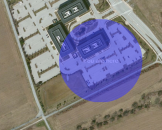</a>
        </td>
        <td>
          <a href="http://analyticalgraphicsinc.github.io/cesium-google-earth-examples/demos/geolocation/" target="_blank">HTML5/Gears/IP Geolocation</a>
          
(Google Earth <a href="http://earth-api-samples.googlecode.com/svn/trunk/demos/geolocation/index.html" target="_blank">version</a>)

        </td>
    </tr>
        <tr>
        <td>
          <a href="http://analyticalgraphicsinc.github.io/cesium-google-earth-examples/demos/multiple/" target="_blank">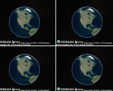</a>
        </td>
        <td>
          <a href="http://analyticalgraphicsinc.github.io/cesium-google-earth-examples/demos/multiple/" target="_blank">Multiple Globes</a>
          
(Google Earth <a href="http://earth-api-samples.googlecode.com/svn/trunk/demos/multiple/index.html" target="_blank">version</a>)

        </td>
    </tr>
    </tr>
        <tr>
        <td>
          <a href="http://analyticalgraphicsinc.github.io/cesium-google-earth-examples/demos/draw/" target="_blank">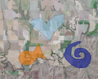</a>
        </td>
        <td>
          <a href="http://analyticalgraphicsinc.github.io/cesium-google-earth-examples/demos/draw/" target="_blank">Draw</a>
          
(Google Earth <a href="http://earth-api-samples.googlecode.com/svn/trunk/demos/draw/index.html" target="_blank">version</a>)

        </td>
    </tr>
    <tr>
        <td>
            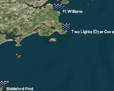
        </td>
        <td>
            
<strong>KML Fetching</strong>

            

                <a href="http://analyticalgraphicsinc.github.io/cesium-google-earth-examples/examples/kmlFetchGood.html">KML Fetch</a>
                (Google Earth <a href="http://earth-api-samples.googlecode.com/svn/trunk/examples/kml-fetch-good.html" target="_blank">version</a>)
            

            

                <a href="http://analyticalgraphicsinc.github.io/cesium-google-earth-examples/examples/kmlFetchInteractive.html">KML Fetch: Interactive</a>
                (Google Earth <a href="http://earth-api-samples.googlecode.com/svn/trunk/examples/kml-fetch-interactive.html" target="_blank">version</a>)
            

        </td>
    </tr>
    <tr>
        <td>
            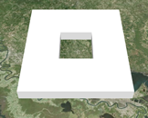
        </td>
        <td>
            
<strong>KML Parsing</strong>

            

                <a href="http://analyticalgraphicsinc.github.io/cesium-google-earth-examples/examples/kmlParse.html">KML Parsing</a>
                (Google Earth <a href="http://earth-api-samples.googlecode.com/svn/trunk/examples/kml-parse.html" target="_blank">version</a>)
            

            

                <a href="http://analyticalgraphicsinc.github.io/cesium-google-earth-examples/examples/kmlParseTimeSpan.html">Parsing KML: Time Span</a>
                (Google Earth <a href="http://earth-api-samples.googlecode.com/svn/trunk/examples/kml-parse-timespan.html" target="_blank">version</a>)
            

        </td>
    </tr>
    <tr>
        <td>
          <a href="http://analyticalgraphicsinc.github.io/cesium-google-earth-examples/examples/groundoverlay.html" target="_blank">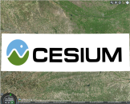</a>
        </td>
        <td>
          <a href="http://analyticalgraphicsinc.github.io/cesium-google-earth-examples/examples/groundoverlay.html" target="_blank">Basic Sample: Creating Ground Overlays </a>
          
(Google Earth <a href="http://earth-api-samples.googlecode.com/svn/trunk/examples/groundoverlay.html" target="_blank">version</a>)

        </td>
    </tr>

    <tr>
        <td>
          <a href="http://analyticalgraphicsinc.github.io/cesium-google-earth-examples/examples/hittest.html" target="_blank">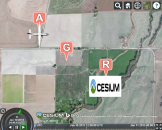</a>
        </td>
        <td>
          <a href="http://analyticalgraphicsinc.github.io/cesium-google-earth-examples/examples/hittest.html" target="_blank">Basic Sample: Hit-Testing</a>
          
(Google Earth <a href="http://earth-api-samples.googlecode.com/svn/trunk/examples/hittest.html" target="_blank">version</a>)

        </td>
    </tr>
        
    <tr>
        <td>
          <a href="http://analyticalgraphicsinc.github.io/cesium-google-earth-examples/examples/pinPoint.html" target="_blank">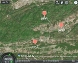</a>
        </td>
        <td>
          <a href="http://analyticalgraphicsinc.github.io/cesium-google-earth-examples/examples/pinPoint.html" target="_blank">Basic Sample: Creating Placemarks </a>
          
(Google Earth <a href="http://earth-api-samples.googlecode.com/svn/trunk/examples/placemark-point.html" target="_blank">version</a>)

        </td>
    </tr>
    
    <tr>
        <td>
          <a href="http://analyticalgraphicsinc.github.io/cesium-google-earth-examples/examples/pinStyle.html" target="_blank">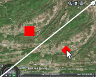</a>
        </td>
        <td>
          <a href="http://analyticalgraphicsinc.github.io/cesium-google-earth-examples/examples/pinStyle.html" target="_blank">Basic Sample: Styling Placemarks </a>
          
(Google Earth <a href="http://earth-api-samples.googlecode.com/svn/trunk/examples/placemark-stylemap.html" target="_blank">version</a>)

        </td>
    </tr>
    
    <tr>
        <td>
          <a href="http://analyticalgraphicsinc.github.io/cesium-google-earth-examples/examples/pinDrag.html" target="_blank">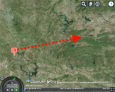</a>
        </td>
        <td>
          <a href="http://analyticalgraphicsinc.github.io/cesium-google-earth-examples/examples/pinDrag.html" target="_blank">Basic Sample: Draggable Placemark </a>
          
(Google Earth <a href="http://earth-api-samples.googlecode.com/svn/trunk/examples/placemark-dragdrop.html" target="_blank">version</a>)

        </td>
    </tr>
    
    <tr>
        <td>
          <a href="http://analyticalgraphicsinc.github.io/cesium-google-earth-examples/examples/polyline.html" target="_blank">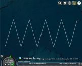</a>
        </td>
        <td>
          <a href="http://analyticalgraphicsinc.github.io/cesium-google-earth-examples/examples/polyline.html" target="_blank">Basic Sample: Creating Line Strings </a>
          
(Google Earth <a href="http://earth-api-samples.googlecode.com/svn/trunk/examples/linestring.html" target="_blank">version</a>)

        </td>
    </tr>
    
    <tr>
        <td>
          <a href="http://analyticalgraphicsinc.github.io/cesium-google-earth-examples/examples/polylineStyle.html" target="_blank">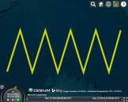</a>
        </td>
        <td>
          <a href="http://analyticalgraphicsinc.github.io/cesium-google-earth-examples/examples/polylineStyle.html" target="_blank">Basic Sample: Line String Styling </a>
          
(Google Earth <a href="http://earth-api-samples.googlecode.com/svn/trunk/examples/linestring-style.html" target="_blank">version</a>)

        </td>
    </tr>
    
    <tr>
        <td>
          <a href="http://analyticalgraphicsinc.github.io/cesium-google-earth-examples/examples/cameraMove.html" target="_blank">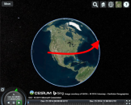</a>
        </td>
        <td>
          <a href="http://analyticalgraphicsinc.github.io/cesium-google-earth-examples/examples/cameraMove.html" target="_blank">Basic Sample: Move Camera</a>
          
(Google Earth <a href="http://earth-api-samples.googlecode.com/svn/trunk/examples/camera-move.html" target="_blank">version</a>)

        </td>
    </tr>
    
    <tr>
        <td>
          <a href="http://analyticalgraphicsinc.github.io/cesium-google-earth-examples/examples/cameraTilt.html" target="_blank">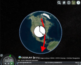</a>
        </td>
        <td>
          <a href="http://analyticalgraphicsinc.github.io/cesium-google-earth-examples/examples/cameraTilt.html" target="_blank">Basic Sample: Tilt Camera</a>
          
(Google Earth <a href="http://earth-api-samples.googlecode.com/svn/trunk/examples/camera-tilt.html" target="_blank">version</a>)

        </td>
    </tr>
    
    <tr>
        <td>
          <a href="http://analyticalgraphicsinc.github.io/cesium-google-earth-examples/examples/cameraTimeout.html" target="_blank">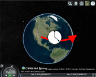</a>
        </td>
        <td>
          <a href="http://analyticalgraphicsinc.github.io/cesium-google-earth-examples/examples/cameraTimeout.html" target="_blank">Basic Sample: Move Camera with Timeouts </a>
          
(Google Earth <a href="http://earth-api-samples.googlecode.com/svn/trunk/examples/camera-move-timeouts.html" target="_blank">version</a>)

        </td>
    </tr>
    
    <tr>
        <td>
          <a href="http://analyticalgraphicsinc.github.io/cesium-google-earth-examples/examples/model.html" target="_blank">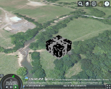</a>
        </td>
        <td>
          <a href="http://analyticalgraphicsinc.github.io/cesium-google-earth-examples/examples/model.html" target="_blank">Basic Sample: Creating 3D Models</a>
          
(Google Earth <a href="http://earth-api-samples.googlecode.com/svn/trunk/examples/model.html" target="_blank">version</a>)

        </td>
    </tr>
    
    <tr>
        <td>
          <a href="http://analyticalgraphicsinc.github.io/cesium-google-earth-examples/examples/terrain.html" target="_blank">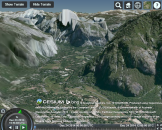</a>
        </td>
        <td>
          <a href="http://analyticalgraphicsinc.github.io/cesium-google-earth-examples/examples/terrain.html" target="_blank">Basic Sample: Show/Hide Terrain</a>
          
(Google Earth <a href="http://earth-api-samples.googlecode.com/svn/trunk/examples/terrain.html" target="_blank">version</a>)

        </td>
    </tr>
    
    <tr>
        <td>
          <a href="http://analyticalgraphicsinc.github.io/cesium-google-earth-examples/examples/groundAlt.html" target="_blank">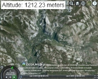</a>
        </td>
        <td>
          <a href="http://analyticalgraphicsinc.github.io/cesium-google-earth-examples/examples/groundAlt.html" target="_blank">Basic Sample: Retrieving Ground Altitude Data</a>
          
(Google Earth <a href="http://earth-api-samples.googlecode.com/svn/trunk/examples/groundaltitude.html" target="_blank">version</a>)

        </td>
    </tr>
    
    <tr>
        <td>
          <a href="http://analyticalgraphicsinc.github.io/cesium-google-earth-examples/examples/sun.html" target="_blank">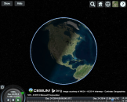</a>
        </td>
        <td>
          <a href="http://analyticalgraphicsinc.github.io/cesium-google-earth-examples/examples/sun.html" target="_blank">Basic Sample: Show/Hide Sun (Dusk to Dawn)</a>
          
(Google Earth <a href="http://earth-api-samples.googlecode.com/svn/trunk/examples/sun.html" target="_blank">version</a>)

        </td>
    </tr>
    <tr>
        <td>
          <a href="http://analyticalgraphicsinc.github.io/cesium-google-earth-examples/examples/globeEvent.html" target="_blank">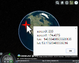</a>
        </td>
        <td>
          <a href="http://analyticalgraphicsinc.github.io/cesium-google-earth-examples/examples/globeEvent.html" target="_blank">Basic Sample: Globe/Window Event Handling</a>
          
(Google Earth <a href="http://earth-api-samples.googlecode.com/svn/trunk/examples/event-globe.html" target="_blank">version</a>)

        </td>
    </tr>
    
    <tr>
        <td>
          <a href="http://analyticalgraphicsinc.github.io/cesium-google-earth-examples/examples/eventListeners.html" target="_blank">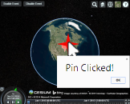</a>
        </td>
        <td>
          <a href="http://analyticalgraphicsinc.github.io/cesium-google-earth-examples/examples/eventListeners.html" target="_blank">Basic Sample: Toggling Event Listeners</a>
          
(Google Earth <a href="http://earth-api-samples.googlecode.com/svn/trunk/examples/event-listeners.html" target="_blank">version</a>)

        </td>
    </tr>

    <tr>
        <td>
          <a href="http://analyticalgraphicsinc.github.io/cesium-google-earth-examples/examples/pinEvent.html" target="_blank">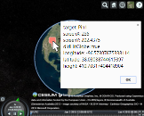</a>
        </td>
        <td>
          <a href="http://analyticalgraphicsinc.github.io/cesium-google-earth-examples/examples/pinEvent.html" target="_blank">Basic Sample: Placemark Click Event Handling</a>
          
(Google Earth <a href="http://earth-api-samples.googlecode.com/svn/trunk/examples/event-placemark.html" target="_blank">version</a>)

        </td>
    </tr>
        
    <tr>
        <td>
          <a href="http://analyticalgraphicsinc.github.io/cesium-google-earth-examples/examples/frameAnimation.html" target="_blank">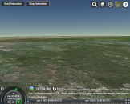</a>
        </td>
        <td>
          <a href="http://analyticalgraphicsinc.github.io/cesium-google-earth-examples/examples/frameAnimation.html" target="_blank">Basic Sample: Smooth Animation with frameend</a>
          
(Google Earth <a href="http://earth-api-samples.googlecode.com/svn/trunk/examples/event-frameend.html" target="_blank">version</a>)

        </td>
    </tr>
    
    <tr>
        <td>
          <a href="http://analyticalgraphicsinc.github.io/cesium-google-earth-examples/examples/viewchangeEvent.html" target="_blank">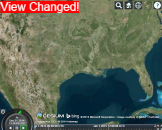</a>
        </td>
        <td>
          <a href="http://analyticalgraphicsinc.github.io/cesium-google-earth-examples/examples/viewchangeEvent.html" target="_blank">Basic Sample: viewchange Event</a>
          
(Google Earth <a href="http://earth-api-samples.googlecode.com/svn/trunk/examples/event-viewchange.html" target="_blank">version</a>)

        </td>
    </tr>
    <tr>
        <td>
          <a href="http://analyticalgraphicsinc.github.io/cesium-google-earth-examples/examples/circle.html" target="_blank">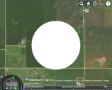</a>
        </td>
        <td>
          <a href="http://analyticalgraphicsinc.github.io/cesium-google-earth-examples/examples/circle.html" target="_blank">Basic Sample: Creating Circle Polygons </a>
          
(Google Earth <a href="http://earth-api-samples.googlecode.com/svn/trunk/examples/polygon-circle.html" target="_blank">version</a>)

        </td>
    </tr>
    <tr>
        <td>
          <a href="http://analyticalgraphicsinc.github.io/cesium-google-earth-examples/examples/nestedCircle.html" target="_blank">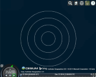</a>
        </td>
        <td>
          <a href="http://analyticalgraphicsinc.github.io/cesium-google-earth-examples/examples/nestedCircle.html" target="_blank">Basic Sample: Creating Multi-Geometry Placemarks</a>
          
(Google Earth <a href="http://earth-api-samples.googlecode.com/svn/trunk/examples/multigeometry.html" target="_blank">version</a>)

        </td>
    </tr>
    <tr>
        <td>
          <a href="http://analyticalgraphicsinc.github.io/cesium-google-earth-examples/examples/polygon.html" target="_blank">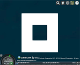</a>
        </td>
        <td>
          <a href="http://analyticalgraphicsinc.github.io/cesium-google-earth-examples/examples/polygon.html" target="_blank">Basic Sample: Creating Polygons </a>
          
(Google Earth <a href="http://earth-api-samples.googlecode.com/svn/trunk/examples/polygon.html" target="_blank">version</a>)

        </td>
    </tr>
    <tr>
        <td>
          <a href="http://analyticalgraphicsinc.github.io/cesium-google-earth-examples/examples/polygonStyle.html" target="_blank">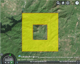</a>
        </td>
        <td>
          <a href="http://analyticalgraphicsinc.github.io/cesium-google-earth-examples/examples/polygonStyle.html" target="_blank">Basic Sample: Polygon Styling</a>
          
(Google Earth <a href="http://earth-api-samples.googlecode.com/svn/trunk/examples/polygon-style.html" target="_blank">version</a>)

        </td>
    </tr>
    <tr>
        <td>
          <a href="http://analyticalgraphicsinc.github.io/cesium-google-earth-examples/examples/screenOverlay.html" target="_blank">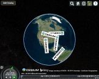</a>
        </td>
        <td>
          <a href="http://analyticalgraphicsinc.github.io/cesium-google-earth-examples/examples/screenOverlay.html" target="_blank">Basic Sample: Creating Screen Overlays</a>
          
(Google Earth <a href="http://earth-api-samples.googlecode.com/svn/trunk/examples/screenoverlay.html" target="_blank">version</a>)

        </td>
    </tr>

    <tr>
        <td>
          <a href="http://analyticalgraphicsinc.github.io/cesium-google-earth-examples/examples/screenFrame.html" target="_blank">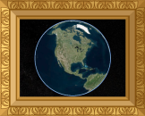</a>
        </td>
        <td>
          <a href="http://analyticalgraphicsinc.github.io/cesium-google-earth-examples/examples/screenFrame.html" target="_blank">Basic Sample: Screen Overlay (Frame)</a>
          
(Google Earth <a href="http://earth-api-samples.googlecode.com/svn/trunk/examples/screenoverlay-frame.html" target="_blank">version</a>)

        </td>
    </tr>
    
    <tr>
        <td>
          <a href="http://analyticalgraphicsinc.github.io/cesium-google-earth-examples/demos/milktruck/" target="_blank">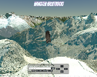</a>
        </td>
        <td>
          <a href="http://analyticalgraphicsinc.github.io/cesium-google-earth-examples/demos/milktruck/" target="_blank">Monster Milktruck</a>
          
(Google Earth <a href="http://earth-api-samples.googlecode.com/svn/trunk/demos/milktruck/index.html" target="_blank">version</a>)

        </td>
    </tr>
</table>

To run the examples locally, clone this repo, install <a href="http://nodejs.org/" target="_blank">node.js</a>, and, from the `cesium-google-earth-examples` root directory, run
<pre>
npm install
node server.js
</pre>
Browse to 
<pre>
http://localhost:8000/
</pre>

